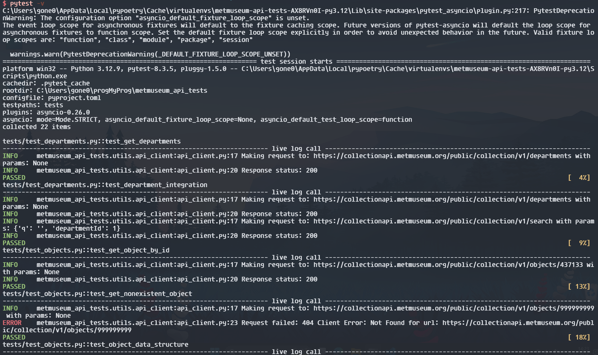
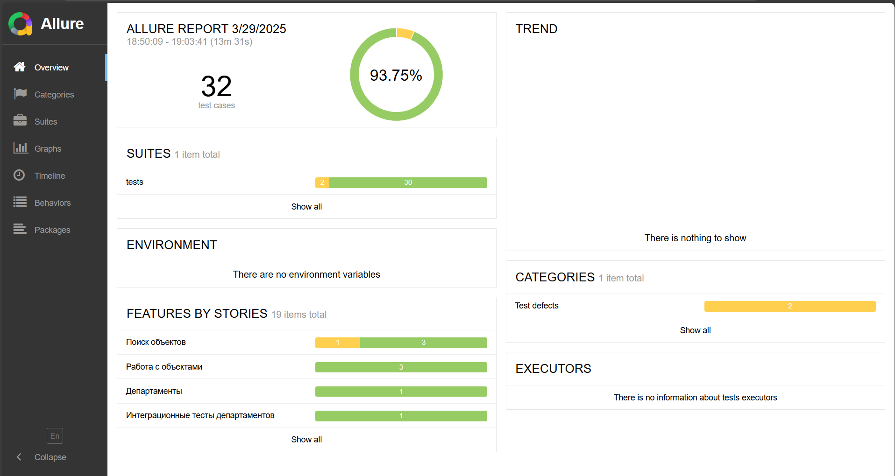

# Автоматизированные тесты для API Музея Метрополитен

# Automated Tests for Metropolitan Museum API

[](https://www.python.org/)
[](https://python-poetry.org/)
[](https://docs.pytest.org/)

## Установка

Для запуска тестов используйте Poetry. Для установки зависимостей выполните команду:

```bash
git clone https://github.com/thedogthe/metmuseum_api_tests.git
cd metmuseum_api_tests
poetry install
poetry shell
```

## 🚀  Для запуска тестов выполните команду

```bash
poetry run pytest -V
```

## 📦 Зависимости

Python 3.12+
requests: для выполнения HTTP-запросов.
pydantic: для валидации данных.
pytest: для написания и запуска тестов.
pytest-asyncio: для работы с асинхронными тестами (если необходимо).

## Логирование

Для удобства отслеживания выполнения тестов добавлено логирование запросов, ответов и ошибок.

## Пример структуры проекта

```metmuseum-api-tests/
├── models/
│   ├── object.py            # Модель объекта искусства
│   ├── objects.py           # Модель списка объектов
│   ├── deapartment.py       # Модель для департаментов
│   └── search.py            # Модель поиска
├── tests/
│   ├── test_objects.py      # Тесты объектов
│   ├── test_search.py       # Тесты поиска
│   └── test_departments.py  # Тесты департаментов
├── utils/
│   └── api_client.py        # Клиент для работы с API
└── pyproject.toml           # Конфигурация проекта
```

## Результат





## TODO

Add test and docs
